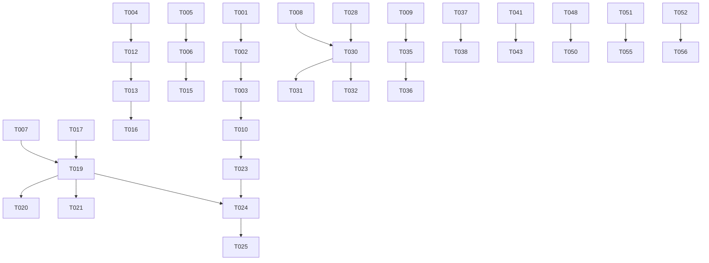

# Takenlijst: Top Tuinen Medewerkers App

**Project:** iOS/Android Employee App
**Geschatte doorlooptijd:** 20 weken
**Status:** In Development
**Laatste Update:** 2026-02-01

---

## Legenda

- [ ] Todo
- [~] In Progress
- [x] Completed
- [!] Blocked

**Prioriteit:**
- 🔴 P0 - Kritisch (must have voor launch)
- 🟠 P1 - Belangrijk (should have)
- 🟡 P2 - Nice to have
- 🟢 P3 - Future

---

## Phase 1: Foundation (Week 1-4) — 70% COMPLETE

### 1.1 Project Setup 🔴

- [x] **T001** Monorepo structuur opzetten met Turborepo
  - [x] T001.1 Root package.json en turbo.json configureren — SKIPPED (standalone app)
  - [x] T001.2 `apps/mobile` folder aanmaken — `mobile/` folder created
  - [x] T001.3 `packages/shared-types` folder aanmaken — SKIPPED (using convex types)
  - [x] T001.4 `packages/shared-utils` folder aanmaken — SKIPPED (using convex utils)
  - [x] T001.5 Workspace dependencies configureren — SKIPPED (standalone)

- [x] **T002** Expo project initialiseren
  - [x] T002.1 `npx create-expo-app apps/mobile --template expo-template-blank-typescript`
  - [x] T002.2 Expo Router installeren en configureren
  - [x] T002.3 app.json configureren (name, slug, version, icons)
  - [x] T002.4 TypeScript strict mode activeren
  - [ ] T002.5 ESLint + Prettier setup

- [~] **T003** Development environment
  - [x] T003.1 EAS CLI installeren en configureren
  - [ ] T003.2 Development build maken voor iOS
  - [ ] T003.3 Development build maken voor Android
  - [ ] T003.4 eas.json configureren (development, preview, production)

### 1.2 Clerk Integratie 🔴

> **Research Afgerond:** Zie `docs/CLERK-EXPO-RESEARCH.md` voor complete documentatie

- [x] **T004** Clerk Expo SDK setup
  - [x] T004.1 `@clerk/expo` installeren — v2.19.21
  - [x] T004.2 ClerkProvider in _layout.tsx configureren
  - [x] T004.3 SecureStore token cache implementeren — `/lib/auth/clerk.ts`
  - [x] T004.4 Environment variables instellen (.env.local)

- [ ] **T005** Clerk Organizations configureren
  - [ ] T005.1 Organizations feature activeren in Clerk Dashboard
  - [ ] T005.2 Organization roles definiëren (manager, member)
  - [ ] T005.3 Invitation email template aanpassen (NL)
  - [ ] T005.4 Webhook endpoint `/api/webhooks/clerk` aanmaken
  - [ ] T005.5 Webhook events configureren (user.created, membership.*)

- [ ] **T006** Backend auth updates
  - [x] T006.1 Convex schema uitbreiden (clerkOrgId, clerkUserId) — Done in schema.ts
  - [ ] T006.2 Medewerkers mutations updaten voor Clerk linking
  - [ ] T006.3 `completeSignup` mutation implementeren
  - [ ] T006.4 Webhook handler implementeren (svix verificatie)

### 1.3 Convex Schema Updates 🔴

- [x] **T007** Offline sync velden toevoegen
  - [x] T007.1 `idempotencyKey` aan urenRegistraties
  - [x] T007.2 `clientTimestamp` aan urenRegistraties
  - [x] T007.3 `syncStatus` aan urenRegistraties
  - [x] T007.4 Index `by_idempotency` aanmaken
  - [ ] T007.5 Migratie script voor bestaande data

- [x] **T008** GPS tracking tabellen
  - [x] T008.1 `locationSessions` tabel aanmaken
  - [x] T008.2 `locationData` tabel aanmaken
  - [x] T008.3 `jobSiteGeofences` tabel aanmaken
  - [x] T008.4 `geofenceEvents` tabel aanmaken
  - [x] T008.5 `routes` tabel aanmaken
  - [x] T008.6 `locationAnalytics` tabel aanmaken
  - [x] T008.7 `locationAuditLog` tabel aanmaken

- [x] **T009** Chat tabellen
  - [x] T009.1 `team_messages` tabel aanmaken
  - [x] T009.2 `direct_messages` tabel aanmaken
  - [x] T009.3 `notification_preferences` tabel aanmaken
  - [x] T009.4 `chat_attachments` tabel aanmaken
  - [x] T009.5 Search indexes configureren

### 1.4 Basic Navigation 🔴

- [x] **T010** Expo Router setup
  - [x] T010.1 `(auth)` route group aanmaken
  - [x] T010.2 `(app)` route group aanmaken — `(tabs)` group
  - [~] T010.3 Auth guard middleware implementeren — Hardcoded, needs Clerk
  - [x] T010.4 Tab navigation configureren — 4 tabs with icons
  - [x] T010.5 Stack navigation per tab

- [~] **T011** UI Component Library
  - [ ] T011.1 NativeWind (Tailwind) installeren — REMOVED (compatibility issues)
  - [~] T011.2 Basis components (Button, Input, Card) — Only Button done
  - [ ] T011.3 Theme configureren (colors, fonts) — Using StyleSheet only
  - [ ] T011.4 Dark mode support

---

## Phase 2: Authentication (Week 3-5) — 40% COMPLETE

### 2.1 Login Flows 🔴

- [~] **T012** Magic Link Authentication
  - [x] T012.1 Login screen UI
  - [x] T012.2 Email input met validatie
  - [ ] T012.3 Magic link verzenden via Clerk — Stubbed with TODO
  - [ ] T012.4 Deep link handler (`toptuinen://auth/callback`)
  - [ ] T012.5 Check-email screen
  - [ ] T012.6 Error handling (invalid link, expired)

- [~] **T013** Biometric Authentication
  - [x] T013.1 `expo-local-authentication` installeren — v17.0.8
  - [x] T013.2 Biometric availability check — `/lib/auth/biometric.ts`
  - [x] T013.3 Biometric type detectie (Face ID vs Touch ID)
  - [x] T013.4 Setup flow na eerste login — UI created
  - [x] T013.5 Token opslag in SecureStore — Implemented
  - [~] T013.6 Biometric login screen — UI only, logic stubbed
  - [ ] T013.7 Fallback naar magic link

- [ ] **T014** Session Management
  - [ ] T014.1 Token refresh hook (50s interval)
  - [ ] T014.2 Offline token caching
  - [ ] T014.3 Max session lifetime (7 dagen)
  - [ ] T014.4 Force logout na expiry
  - [ ] T014.5 Last login timestamp tracking

### 2.2 Onboarding 🟠

- [ ] **T015** Employee Invitation Flow
  - [ ] T015.1 Invitation email template (NL)
  - [ ] T015.2 Deep link naar app vanuit email
  - [ ] T015.3 Organization membership check
  - [ ] T015.4 Redirect naar signup als niet member

- [ ] **T016** Profile Completion
  - [ ] T016.1 Welcome screen
  - [ ] T016.2 Profiel invullen (naam, telefoon)
  - [ ] T016.3 GPS consent flow (zie T025)
  - [ ] T016.4 Biometric setup prompt
  - [ ] T016.5 Onboarding complete screen

---

## Phase 3: Offline Sync Engine (Week 5-8) — 60% COMPLETE

### 3.1 Local Database 🔴

- [x] **T017** SQLite Setup
  - [x] T017.1 `expo-sqlite` installeren — v16.0.10
  - [x] T017.2 Database initialisatie — `/lib/storage/database.ts`
  - [x] T017.3 Schema migraties systeem — `/lib/storage/migrations.ts`
  - [x] T017.4 `uren_registraties` tabel
  - [x] T017.5 `sync_queue` tabel
  - [x] T017.6 `location_cache` tabel
  - [x] T017.7 `offline_metadata` tabel

- [x] **T018** Database Helpers
  - [x] T018.1 CRUD operaties wrapper
  - [x] T018.2 Query builders — Via SQLite API
  - [x] T018.3 Transaction support — execAsync
  - [x] T018.4 Data type converters (JSON <-> SQLite)

### 3.2 Sync Engine 🔴

- [x] **T019** Core Sync Logic
  - [x] T019.1 SyncEngine class implementeren — `/lib/storage/sync-engine.ts`
  - [x] T019.2 addUrenRegistratie (lokaal opslaan) — addToSyncQueue
  - [x] T019.3 syncToServer (batch sync) — processSyncQueue
  - [x] T019.4 Idempotency key generatie (UUID v7)
  - [x] T019.5 Retry logic (max 3 attempts)
  - [x] T019.6 Exponential backoff

- [ ] **T020** Background Sync
  - [ ] T020.1 `expo-background-fetch` installeren
  - [ ] T020.2 `expo-task-manager` installeren
  - [ ] T020.3 Background task registreren
  - [ ] T020.4 15-minuten sync interval
  - [ ] T020.5 Network status check — NetInfo installed
  - [ ] T020.6 Battery-aware scheduling

- [~] **T021** Conflict Resolution
  - [x] T021.1 Server-side conflict detection (Convex) — Basic logic in schema
  - [~] T021.2 Client-side conflict handling — Partial in sync-engine
  - [ ] T021.3 Conflict resolution UI
  - [ ] T021.4 User choice: server vs local vs merge
  - [ ] T021.5 Audit logging van conflicts

- [ ] **T022** Sync Status UI
  - [ ] T022.1 Sync indicator component
  - [ ] T022.2 Pending count badge
  - [ ] T022.3 Error state indicator
  - [ ] T022.4 Manual sync button
  - [ ] T022.5 Sync history view

---

## Phase 4: Uren Registratie (Week 6-9) — 40% COMPLETE

### 4.1 Core Features 🔴

- [~] **T023** Dashboard Screen
  - [x] T023.1 Welkom header (naam, datum) — UI only
  - [x] T023.2 Huidige status card (ingeklokt/niet) — Placeholder
  - [x] T023.3 Actief project weergave — Placeholder
  - [x] T023.4 Quick actions (start/stop) — UI only
  - [ ] T023.5 Vandaag gewerkte uren — Not connected to data
  - [ ] T023.6 Sync status indicator

- [~] **T024** Uren Entry Flow
  - [x] T024.1 Project selector (dropdown) — Placeholder UI
  - [x] T024.2 Start werkdag button — UI only
  - [x] T024.3 Timer weergave — Shows 0:00:00
  - [ ] T024.4 Pauze functie
  - [x] T024.5 Stop werkdag button — UI only
  - [ ] T024.6 Uren bevestiging modal
  - [ ] T024.7 Notities invoer
  - [ ] T024.8 Scope/taak koppeling (optioneel)

### 4.2 Overzichten 🟠

- [~] **T025** Dag Overzicht
  - [x] T025.1 Lijst van registraties — Placeholder
  - [ ] T025.2 Totaal uren vandaag
  - [ ] T025.3 Per project breakdown
  - [ ] T025.4 Inline editing
  - [ ] T025.5 Delete functie

- [~] **T026** Week Overzicht
  - [x] T026.1 Week selector — Day cards visible
  - [ ] T026.2 Per dag totalen
  - [ ] T026.3 Per project totalen
  - [ ] T026.4 Grafiek visualisatie
  - [ ] T026.5 Export naar PDF (future)

- [ ] **T027** Projecten Lijst
  - [ ] T027.1 Actieve projecten ophalen
  - [ ] T027.2 Project details weergave
  - [ ] T027.3 Klant info
  - [ ] T027.4 Team leden
  - [ ] T027.5 Recent activity

---

## Phase 5: GPS Tracking (Week 9-12) — 0% COMPLETE

> **Research Afgerond:** Zie `docs/GPS-TRACKING-RESEARCH.md` voor complete documentatie

### 5.1 Permissions & Consent 🔴

- [ ] **T028** GPS Consent Flow
  - [ ] T028.1 Consent dialog UI (NL tekst)
  - [ ] T028.2 Privacy level keuzes (full/aggregated/minimal)
  - [ ] T028.3 Rechten uitleg
  - [ ] T028.4 Consent opslag (Convex)
  - [ ] T028.5 Audit log entry
  - [ ] T028.6 Consent intrekken optie

- [ ] **T029** Permission Requests
  - [ ] T029.1 Foreground location permission
  - [ ] T029.2 Background location permission
  - [ ] T029.3 iOS Info.plist entries
  - [ ] T029.4 Android manifest entries
  - [ ] T029.5 Permission denied handling

### 5.2 Location Tracking 🔴

- [ ] **T030** Location Service
  - [ ] T030.1 `expo-location` installeren
  - [ ] T030.2 LocationService class
  - [ ] T030.3 Start tracking functie
  - [ ] T030.4 Stop tracking functie
  - [ ] T030.5 Background task registratie
  - [ ] T030.6 Foreground service notification (Android)

- [ ] **T031** Battery Optimization
  - [ ] T031.1 BatteryOptimizer class
  - [ ] T031.2 Tracking profiles (balanced/precision/saver)
  - [ ] T031.3 Adaptive interval berekening
  - [ ] T031.4 Battery level monitoring
  - [ ] T031.5 Location point compression
  - [ ] T031.6 Batch syncing

- [ ] **T032** Geofencing
  - [ ] T032.1 GeofenceManager class
  - [ ] T032.2 Haversine distance berekening
  - [ ] T032.3 Circle geofence check
  - [ ] T032.4 Enter/exit/dwell detectie
  - [ ] T032.5 Auto clock-in trigger
  - [ ] T032.6 Auto clock-out trigger

### 5.3 Location Data 🟠

- [ ] **T033** Data Storage
  - [ ] T033.1 Location buffer (lokaal)
  - [ ] T033.2 Batch sync naar Convex
  - [ ] T033.3 Location session management
  - [ ] T033.4 Route calculation
  - [ ] T033.5 Daily analytics aggregatie

- [ ] **T034** Location UI
  - [ ] T034.1 Tracking status indicator
  - [ ] T034.2 Current location weergave
  - [ ] T034.3 Privacy level badge
  - [ ] T034.4 Battery impact warning
  - [ ] T034.5 Settings scherm (privacy level aanpassen)

---

## Phase 6: Chat Module (Week 13-16) — 20% COMPLETE

### 6.1 Team Chat 🟠

- [ ] **T035** Chat Backend (Convex)
  - [ ] T035.1 sendTeamMessage mutation
  - [ ] T035.2 getTeamChat query (real-time)
  - [ ] T035.3 markChannelAsRead mutation
  - [ ] T035.4 getAllUnreadCounts query
  - [ ] T035.5 searchMessages query

- [~] **T036** Team Chat UI
  - [x] T036.1 Chat list screen — Placeholder
  - [x] T036.2 Message list component (FlashList) — Using ScrollView
  - [x] T036.3 Message bubble component — Basic styling
  - [x] T036.4 Message input component
  - [x] T036.5 Send button
  - [ ] T036.6 Keyboard avoiding view
  - [ ] T036.7 Pull to refresh
  - [ ] T036.8 Load more (pagination)

### 6.2 Direct Messages 🟠

- [ ] **T037** DM Backend
  - [ ] T037.1 sendDirectMessage mutation
  - [ ] T037.2 getConversation query
  - [ ] T037.3 getConversationList query
  - [ ] T037.4 markDMAsRead mutation

- [ ] **T038** DM UI
  - [ ] T038.1 Conversations list
  - [ ] T038.2 Conversation header (met naam)
  - [ ] T038.3 New DM - employee picker
  - [ ] T038.4 Unread badge per conversation

### 6.3 Project Chat 🟠

- [ ] **T039** Project Chat
  - [ ] T039.1 Project channel creation
  - [ ] T039.2 Auto-join project team
  - [ ] T039.3 Project chat screen
  - [ ] T039.4 Project context header

### 6.4 Media & Attachments 🟡

- [ ] **T040** Image Upload
  - [ ] T040.1 generateUploadUrl mutation
  - [ ] T040.2 Image picker component
  - [ ] T040.3 Upload progress indicator
  - [ ] T040.4 Image preview in chat
  - [ ] T040.5 Full screen image viewer
  - [ ] T040.6 File type validation

### 6.5 Push Notifications 🟠

- [ ] **T041** Push Setup
  - [ ] T041.1 `expo-notifications` installeren
  - [ ] T041.2 Permission request
  - [ ] T041.3 Device token ophalen
  - [ ] T041.4 Token registratie (Convex)
  - [ ] T041.5 Android notification channel

- [ ] **T042** Notification Handling
  - [ ] T042.1 Foreground notification handler
  - [ ] T042.2 Background notification handler
  - [ ] T042.3 Notification tap → navigate
  - [ ] T042.4 Badge count update
  - [ ] T042.5 Notification preferences screen

- [ ] **T043** Server Push (Convex Actions)
  - [ ] T043.1 Push action implementeren
  - [ ] T043.2 Firebase FCM integratie
  - [ ] T043.3 Recipient filtering (preferences)
  - [ ] T043.4 Quiet hours respect
  - [ ] T043.5 Rate limiting

---

## Phase 7: Settings & Profile (Week 15-17) — 30% COMPLETE

### 7.1 Profile 🟠

- [~] **T044** Profile Screen
  - [x] T044.1 Avatar weergave — Initials display
  - [x] T044.2 Naam weergave/edit — Placeholder
  - [x] T044.3 Email (read-only) — Placeholder
  - [ ] T044.4 Telefoon edit
  - [x] T044.5 Functie weergave — Placeholder
  - [~] T044.6 Logout button — Stubbed

### 7.2 Settings 🟠

- [ ] **T045** Privacy Settings
  - [ ] T045.1 GPS tracking toggle
  - [ ] T045.2 Privacy level selector
  - [ ] T045.3 Data export button
  - [ ] T045.4 Data delete request
  - [ ] T045.5 Consent history

- [ ] **T046** Notification Settings
  - [ ] T046.1 Push notifications toggle
  - [ ] T046.2 Team chat notifications
  - [ ] T046.3 DM notifications
  - [ ] T046.4 Project chat notifications
  - [ ] T046.5 Quiet hours configuratie

- [~] **T047** App Settings
  - [~] T047.1 Biometric toggle — UI only
  - [~] T047.2 Theme (light/dark/system) — Placeholder
  - [~] T047.3 Language (NL/EN) — Placeholder
  - [x] T047.4 App version info — In UI
  - [ ] T047.5 Support/help link

---

## Phase 8: Testing (Week 17-18) — 0% COMPLETE

### 8.1 Unit Tests 🟠

- [ ] **T048** Core Logic Tests
  - [ ] T048.1 SyncEngine tests
  - [ ] T048.2 BatteryOptimizer tests
  - [ ] T048.3 GeofenceManager tests
  - [ ] T048.4 Auth helper tests
  - [ ] T048.5 Date/format utility tests

### 8.2 Integration Tests 🟠

- [ ] **T049** Flow Tests
  - [ ] T049.1 Offline → Online sync flow
  - [ ] T049.2 Conflict resolution flow
  - [ ] T049.3 Auth token refresh flow
  - [ ] T049.4 Biometric fallback flow

### 8.3 E2E Tests 🟡

- [ ] **T050** Critical Paths
  - [ ] T050.1 Login flow (magic link)
  - [ ] T050.2 Login flow (biometric)
  - [ ] T050.3 Uren registratie flow
  - [ ] T050.4 Chat send/receive
  - [ ] T050.5 GPS consent flow

### 8.4 Device Testing 🔴

- [ ] **T051** iOS Testing
  - [ ] T051.1 iPhone 12/13/14/15 simulators
  - [ ] T051.2 Physical iPhone test
  - [ ] T051.3 iPad test (if supported)
  - [ ] T051.4 iOS 15/16/17 compatibility

- [ ] **T052** Android Testing
  - [ ] T052.1 Pixel emulators
  - [ ] T052.2 Samsung physical test
  - [ ] T052.3 Android 10/11/12/13/14 compatibility
  - [ ] T052.4 Different screen sizes

---

## Phase 9: Polish & Launch (Week 18-20) — 5% COMPLETE

### 9.1 Performance 🟠

- [ ] **T053** Optimizations
  - [ ] T053.1 App startup time < 2s
  - [ ] T053.2 List virtualization (FlashList)
  - [ ] T053.3 Image caching
  - [ ] T053.4 Bundle size analysis
  - [ ] T053.5 Memory leak detection

### 9.2 Error Handling 🔴

- [ ] **T054** Error Management
  - [ ] T054.1 Sentry setup
  - [ ] T054.2 Error boundaries
  - [ ] T054.3 Offline error handling
  - [ ] T054.4 User-friendly error messages (NL)
  - [ ] T054.5 Crash reporting

### 9.3 App Store Prep 🔴

- [ ] **T055** iOS App Store
  - [ ] T055.1 App icon (1024x1024)
  - [ ] T055.2 Screenshots (6.5", 5.5")
  - [ ] T055.3 App beschrijving (NL)
  - [ ] T055.4 Privacy policy page
  - [ ] T055.5 Apple Developer account setup
  - [ ] T055.6 TestFlight build
  - [ ] T055.7 App Store submission

- [ ] **T056** Google Play
  - [ ] T056.1 Feature graphic (1024x500)
  - [ ] T056.2 Screenshots (phone)
  - [ ] T056.3 App beschrijving (NL)
  - [ ] T056.4 Data safety form
  - [ ] T056.5 Google Play Console setup
  - [ ] T056.6 Internal testing build
  - [ ] T056.7 Production release

### 9.4 Documentation 🟠

- [ ] **T057** User Documentation
  - [ ] T057.1 Gebruikershandleiding (NL)
  - [ ] T057.2 Quick start guide
  - [ ] T057.3 FAQ
  - [ ] T057.4 Privacy policy
  - [ ] T057.5 Terms of service

- [ ] **T058** Developer Documentation
  - [ ] T058.1 Setup guide
  - [ ] T058.2 Architecture overview
  - [ ] T058.3 API documentation
  - [ ] T058.4 Deployment guide

---

## Backlog (Post-Launch) 🟢

### Future Features

- [ ] **T100** Foto's bij urenregistraties
- [ ] **T101** Materiaaldeclaraties
- [ ] **T102** Verlofaanvragen
- [ ] **T103** Expense tracking
- [ ] **T104** Video berichten
- [ ] **T105** Voice messages
- [ ] **T106** Apple Watch app
- [ ] **T107** Wear OS app
- [ ] **T108** Homescreen widgets
- [ ] **T109** Integratie Exact Online
- [ ] **T110** Integratie Twinfield

---

## Progress Summary

| Phase | Description | Progress | Status |
|-------|-------------|----------|--------|
| 1 | Foundation | 70% | ✅ Mostly Complete |
| 2 | Authentication | 40% | 🔄 In Progress |
| 3 | Offline Sync | 60% | 🔄 Partial |
| 4 | Uren Registratie | 40% | 🔄 UI Only |
| 5 | GPS Tracking | 0% | ⏳ Not Started |
| 6 | Chat Module | 20% | 🔄 UI Only |
| 7 | Settings/Profile | 30% | 🔄 UI Only |
| 8 | Testing | 0% | ⏳ Not Started |
| 9 | Polish & Launch | 5% | ⏳ Not Started |
| **OVERALL** | **Mobile App** | **31%** | **Early Development** |

---

## Dependencies

---

## Team Toewijzing (Suggestie)

| Taak Range | Rol | Expertise |
|------------|-----|-----------|
| T001-T011 | Mobile Developer | React Native, Expo |
| T012-T016 | Mobile Developer | Auth, Clerk |
| T017-T022 | Mobile Developer | SQLite, Sync |
| T023-T027 | Mobile Developer | UI/UX |
| T028-T034 | Mobile Developer | GPS, Native APIs |
| T035-T043 | Mobile Developer | Real-time, Push |
| T044-T047 | Mobile Developer | Settings, Polish |
| T004-T009 | Backend Developer | Convex, Webhooks |
| T048-T052 | QA Engineer | Testing |
| T055-T058 | DevOps/PM | Deployment, Docs |

---

## Milestones

| Milestone | Target Date | Key Deliverables |
|-----------|-------------|------------------|
| M1: Foundation | Week 4 | Project setup, auth flow working |
| M2: MVP Core | Week 9 | Uren registratie met offline sync |
| M3: GPS Beta | Week 12 | Location tracking met consent |
| M4: Chat Beta | Week 16 | Team chat working |
| M5: Feature Complete | Week 18 | All P0/P1 features done |
| M6: Launch Ready | Week 20 | App Store approved |

---

## Risico's per Fase

| Fase | Risico | Mitigatie |
|------|--------|-----------|
| Phase 1 | Monorepo complexity | Start simpel, itereer |
| Phase 2 | Biometric edge cases | Uitgebreide fallbacks |
| Phase 3 | Sync conflicts | Logging, user choice |
| Phase 4 | UI performance | FlashList, memo's |
| Phase 5 | iOS background limits | Foreground service |
| Phase 6 | Push delivery | Multiple providers |
| Phase 8 | Device fragmentation | Breed testen |
| Phase 9 | App Store rejection | Pre-review checklist |

---

*Laatste update: 2026-02-01*

---

## Research Documenten

| Research | Status | Document |
|----------|--------|----------|
| Clerk Expo Integratie | Afgerond | `docs/CLERK-EXPO-RESEARCH.md` |
| Push Notifications Setup | Afgerond | `docs/PUSH-NOTIFICATIONS-RESEARCH.md` |
| GPS Tracking (expo-location) | Afgerond | `docs/GPS-TRACKING-RESEARCH.md` |
| SQLite Offline Sync Patterns | Afgerond | `docs/SQLITE-SYNC-RESEARCH.md` |
